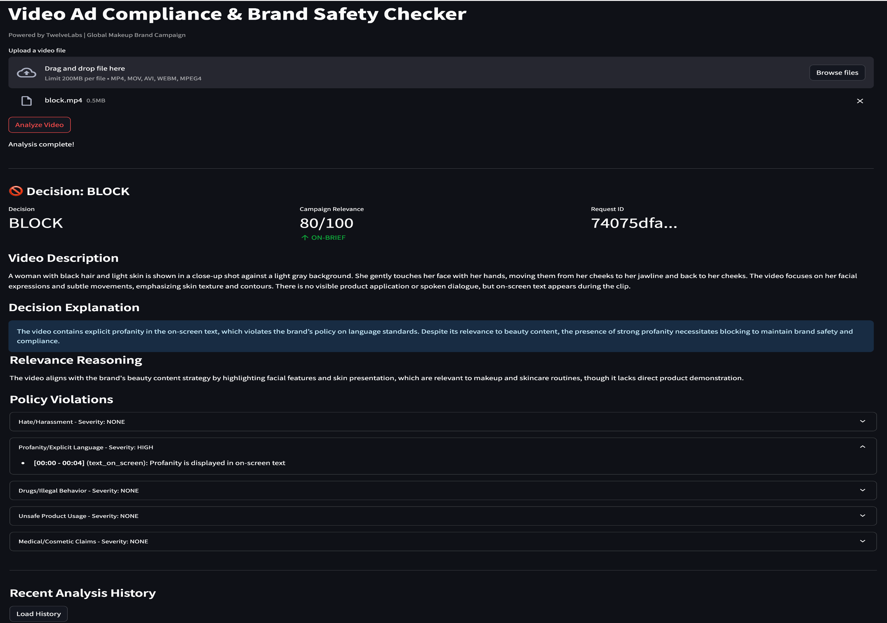

# Video Ad Compliance & Brand Safety System

TwelveLabs Python SDK를 활용한 크리에이터 영상 광고 컴플라이언스 자동 심사 시스템.

## Demo

아래는 화장품 메이크업 영상을 업로드하여 컴플라이언스 분석을 수행한 실제 결과 화면입니다.



비디오를 업로드하면 TwelveLabs의 멀티모달 AI가 영상의 시각, 음성, 텍스트를 종합 분석하여:

- **Decision (BLOCK)**: 화면 내 욕설 텍스트가 감지되어 브랜드 안전성 기준 위반으로 차단 판정
- **Campaign Relevance (80/100, ON-BRIEF)**: 뷰티 콘텐츠로서 캠페인 관련성은 높으나 정책 위반으로 차단
- **Video Description**: 영상 내용을 2-5문장으로 자동 요약
- **Decision Explanation**: 광고주에게 제공할 판정 근거를 명확히 서술
- **Policy Violations (5 categories)**: 5개 정책 카테고리별 위반 여부와 심각도를 개별 표시 — `Profanity/Explicit Language: HIGH` 감지, 타임스탬프 `[00:00 - 00:04]` 및 모달리티 `(text_on_screen)` 증거 포함

위 예시에서는 Profanity 카테고리에서 `HIGH` 심각도 위반이 감지되어 **BLOCK** 판정이 내려졌습니다.

---

## TwelveLabs SDK Usage

이 시스템은 TwelveLabs Python SDK(`twelvelabs==1.2.2`)를 통해 3가지 핵심 API를 호출하여, **비디오 업로드 → 멀티모달 인덱싱 → 컴플라이언스 분석**의 전체 파이프라인을 자동화합니다. 모든 API 호출은 SDK를 통해 이루어지며, 별도의 REST 직접 호출은 없습니다.

### SDK & Import 정보

| 항목 | 값 |
|---|---|
| **패키지** | `twelvelabs` (PyPI) |
| **버전** | `1.2.2` |
| **설치** | `pip install twelvelabs==1.2.2` |

```python
from twelvelabs import TwelveLabs

client = TwelveLabs(api_key="YOUR_API_KEY")
```

- `TwelveLabs` — SDK 메인 클라이언트. `client.indexes.*`, `client.tasks.*`, `client.analyze()` 등 리소스별 네임스페이스로 API 호출

### 1. Index API — 비디오 인덱스 관리

> **파일**: `app/twelvelabs_client.py` (`_ensure_index` 메서드)

| 엔드포인트 | SDK 메서드 | 역할 |
|---|---|---|
| `GET /indexes` | `client.indexes.list()` | 기존 인덱스 목록 조회 |
| `POST /indexes` | `client.indexes.create()` | 새 인덱스 생성 |

**시나리오에서의 역할**: 모든 비디오 분석의 전제 조건인 인덱스를 관리합니다. 인덱스는 비디오가 Pegasus 모델에 의해 임베딩되어 저장되는 논리적 컨테이너로, 시스템 시작 시 `ad-compliance`라는 이름의 인덱스가 존재하는지 확인하고, 없으면 자동으로 생성합니다.

```python
from twelvelabs.indexes import IndexesCreateRequestModelsItem

index = self._client.indexes.create(
    index_name="ad-compliance",
    models=[
        IndexesCreateRequestModelsItem(
            model_name="pegasus1.2",
            model_options=["visual", "audio"],
        )
    ],
)
```

- **모델**: `pegasus1.2` — TwelveLabs의 멀티모달 비디오 임베딩 모델
- **모달리티**: `visual` + `audio` — 시각 정보(프레임, 텍스트 OCR)와 오디오(음성, 소리)를 모두 인덱싱
- 이 설정으로 이후 Analyze API가 시각/음성/화면 텍스트를 모두 활용한 분석이 가능

### 2. Task API — 비디오 업로드 및 인덱싱

> **파일**: `app/twelvelabs_client.py` (`index_video`, `_wait_for_task` 메서드)

| 엔드포인트 | SDK 메서드 | 역할 |
|---|---|---|
| `POST /tasks` | `client.tasks.create(index_id, video_file=...)` | 로컬 파일을 업로드하여 인덱싱 |
| `GET /tasks/{id}` | `client.tasks.retrieve(task_id=...)` | 인덱싱 작업 상태 폴링 |

**시나리오에서의 역할**: 사용자가 제출한 비디오를 TwelveLabs 플랫폼에 전송하고, Pegasus 모델이 비디오의 모든 프레임, 음성, 화면 텍스트를 분석하여 멀티모달 임베딩을 생성할 때까지 대기합니다. 이 단계가 완료되어야 Analyze API로 컴플라이언스 심사가 가능합니다.

**비동기 작업 폴링**: Task API는 비동기로 동작하므로, 5초 간격으로 `tasks.retrieve()`를 호출하여 `status`가 `ready`가 될 때까지 폴링합니다 (최대 600초 타임아웃). 인덱싱이 완료되면 `video_id`를 반환받아 다음 단계로 전달합니다.

### 3. Analyze API — 멀티모달 비디오 컴플라이언스 분석

> **파일**: `app/twelvelabs_client.py` (`analyze_compliance` 메서드)

| 엔드포인트 | 호출 방식 | 역할 |
|---|---|---|
| `POST /analyze` | SDK (`client.analyze()`) | 비디오에 대한 자연어 프롬프트 기반 멀티모달 분석 |

**시나리오에서의 역할**: 이 시스템의 **핵심 API**입니다. 인덱싱이 완료된 비디오에 대해 맞춤형 컴플라이언스 프롬프트를 전송하면, TwelveLabs가 비디오의 **시각(visual)**, **음성(speech)**, **화면 텍스트(text_on_screen)** 3가지 모달리티를 종합 분석하여 구조화된 컴플라이언스 리포트를 반환합니다.

```python
result = client.analyze(
    video_id=video_id,
    prompt=COMPLIANCE_PROMPT,
)
```

**프롬프트가 요구하는 분석 항목**:

| 항목 | 설명 | TwelveLabs의 역할 |
|---|---|---|
| `video_description` | 비디오 내용 2-5문장 요약 | 시각+음성+텍스트를 종합하여 비디오 내용 이해 |
| `campaign_relevance` | 캠페인 brief 부합도 (0-100점) | 비디오가 메이크업/뷰티 콘텐츠인지 멀티모달로 판단 |
| `policy_violations` | 5개 카테고리별 위반 여부 + 증거 | 특정 타임스탬프에서 어떤 모달리티로 위반이 감지되었는지 추출 |
| `decision` | APPROVE / REVIEW / BLOCK | 위 분석을 종합한 최종 판정 |
| `explanation` | 광고주에게 전달할 판정 근거 | 자연어로 의사결정 근거 설명 생성 |

**왜 TwelveLabs Analyze API가 핵심인가**:
- 일반 LLM은 비디오를 직접 이해하지 못하지만, TwelveLabs는 비디오 전용 멀티모달 모델로 **프레임 단위의 시각 정보, 음성 전사, OCR 텍스트를 동시에** 처리
- 단일 API 호출로 비디오 전체에 대한 **타임스탬프 기반 증거(evidence)** 추출이 가능 — "MM:SS - MM:SS 구간에서 어떤 모달리티로 무엇이 감지되었는지" 구조화된 응답
- 커스텀 프롬프트를 통해 **도메인별 정책(광고 컴플라이언스)에 맞춘 분석**이 가능하므로, 범용 비디오 분류 API와 달리 브랜드 안전성 기준을 유연하게 정의 가능

### API 흐름 요약

```
사용자가 비디오 업로드
         │
         ▼
┌─────────────────────────┐
│  1. Index API           │  인덱스 존재 확인 → 없으면 생성
│     index.list()        │  (Pegasus 1.2, visual+audio)
│     index.create()      │
└────────────┬────────────┘
             │
             ▼
┌─────────────────────────┐
│  2. Task API            │  비디오를 TwelveLabs에 전송
│     task.create(file)   │  → 멀티모달 임베딩 생성 대기
│     task.retrieve()     │  → status=ready 까지 폴링
└────────────┬────────────┘
             │ video_id 반환
             ▼
┌─────────────────────────┐
│  3. Analyze API         │  컴플라이언스 프롬프트 전송
│     client.analyze()    │  → 시각/음성/텍스트 종합 분석
│                         │  → 구조화된 JSON 리포트 반환
└────────────┬────────────┘
             │
             ▼
   Streamlit UI에 결과 표시
   + S3/DynamoDB에 저장
```

---

## Architecture

- **App**: Streamlit (단일 ECS Fargate 컨테이너)
- **Video Analysis**: TwelveLabs Python SDK (Index + Task + Analyze)
- **Storage**: S3 (videos) + DynamoDB (results)
- **CDN**: CloudFront (HTTPS, ALB는 CloudFront IP만 허용)
- **IaC**: AWS CDK (Python, 4 stacks)

## Quick Start (Local)

```bash
cd app
cp ../backend/.env.example .env  # Set your TwelveLabs API key
pip install -r requirements.txt
streamlit run streamlit_app.py
```

## Deploy to AWS

```bash
# 1. Store TwelveLabs API key in Secrets Manager
aws secretsmanager create-secret --name twelvelabs-api-key --secret-string "your-key"

# 2. Deploy all stacks
cd cdk
pip install -r requirements.txt
npx aws-cdk bootstrap
npx aws-cdk deploy --all
```

## Video Input

| Method | Supported | How |
|---|---|---|
| File Upload (.mp4, .mov, .avi, .webm) | Yes | TwelveLabs Task API (file) |

## Policy Categories (5)

1. Hate / Harassment
2. Profanity / Explicit Language
3. Drugs / Illegal Behavior
4. Unsafe or Misleading Product Usage
5. Medical / Cosmetic Claims

## Decision Output

- **APPROVE**: No violations, clearly on-brief
- **REVIEW**: Minor/ambiguous violations or borderline relevance
- **BLOCK**: Severe violations or off-brief content
