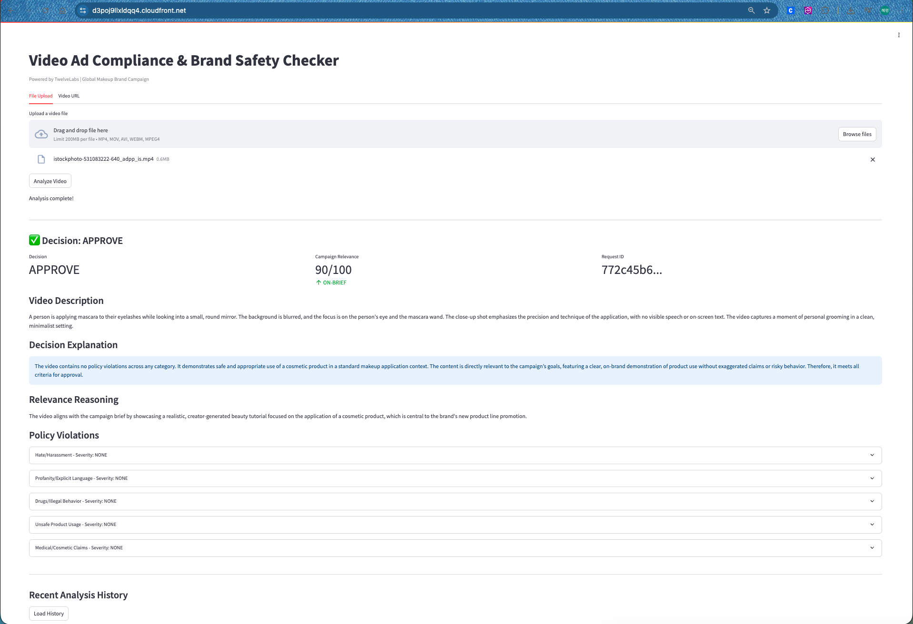

# Video Ad Compliance & Brand Safety System

TwelveLabs API를 활용한 크리에이터 영상 광고 컴플라이언스 자동 심사 시스템.

## Demo

아래는 화장품 메이크업 영상을 업로드하여 컴플라이언스 분석을 수행한 실제 결과 화면입니다.



비디오를 업로드하면 TwelveLabs의 멀티모달 AI가 영상의 시각, 음성, 텍스트를 종합 분석하여:

- **Decision (APPROVE)**: 정책 위반 없이 캠페인 brief에 부합하는 영상으로 판정
- **Campaign Relevance (90/100)**: 메이크업 튜토리얼/제품 데모로서 높은 관련성 확인
- **Video Description**: 영상 내용을 2-5문장으로 자동 요약
- **Decision Explanation**: 광고주에게 제공할 판정 근거를 명확히 서술
- **Policy Violations (5 categories)**: 5개 정책 카테고리별 위반 여부와 심각도를 개별 표시

위 예시에서는 모든 카테고리가 `NONE`으로 위반 사항이 없어 **APPROVE** 판정이 내려졌습니다.

## Architecture

- **App**: Streamlit (단일 ECS Fargate 컨테이너)
- **Video Analysis**: TwelveLabs API (Task + Analyze)
- **Storage**: S3 (videos) + DynamoDB (results)
- **CDN**: CloudFront (HTTPS, ALB는 CloudFront IP만 허용)
- **IaC**: AWS CDK (Python, 4 stacks)

## Quick Start (Local)

```bash
cd app
cp ../backend/.env.example .env  # Set your TwelveLabs API key
pip install -r requirements.txt
streamlit run streamlit_app.py
```

## Deploy to AWS

```bash
# 1. Store TwelveLabs API key in Secrets Manager
aws secretsmanager create-secret --name twelvelabs-api-key --secret-string "your-key"

# 2. Deploy all stacks
cd cdk
pip install -r requirements.txt
npx aws-cdk bootstrap
npx aws-cdk deploy --all
```

## Video Input

| Method | Supported | How |
|---|---|---|
| File Upload (.mp4, .mov, .avi, .webm) | Yes | TwelveLabs Task API (file) |
| Direct Video URL (.mp4) | Yes | TwelveLabs Task API (url) |
| YouTube/Vimeo page URL | No | Platform bot detection blocks cloud IPs |

## Policy Categories (5)

1. Hate / Harassment
2. Profanity / Explicit Language
3. Drugs / Illegal Behavior
4. Unsafe or Misleading Product Usage
5. Medical / Cosmetic Claims

## Decision Output

- **APPROVE**: No violations, clearly on-brief
- **REVIEW**: Minor/ambiguous violations or borderline relevance
- **BLOCK**: Severe violations or off-brief content
